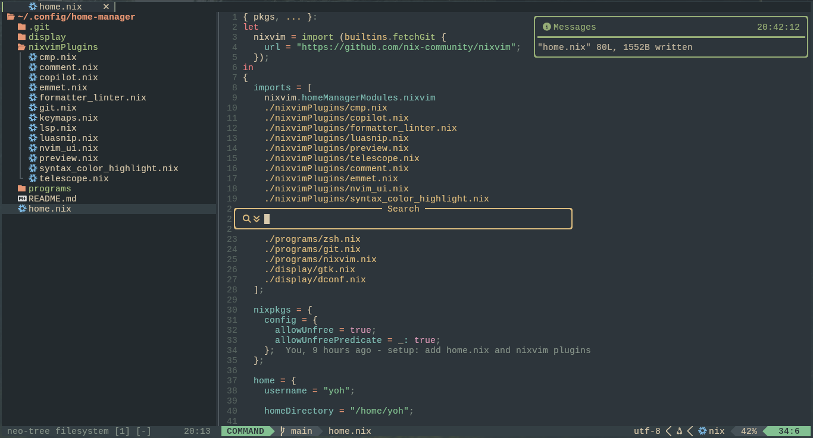
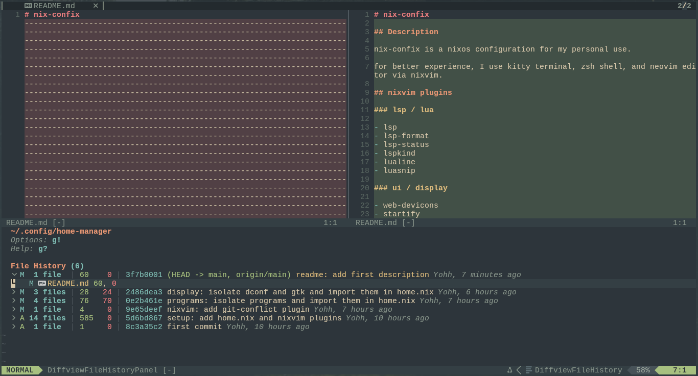

# nix-confix

## Description

nix-confix is a nixos configuration for my personal use.

for better experience, I use kitty terminal, zsh shell, and neovim editor via nixvim.

## nixvim plugins

### lsp / lua

- [lsp](https://github.com/neovim/nvim-lspconfig/)
- [lsp-format](https://github.com/lukas-reineke/lsp-format.nvim/)
- [lsp-status](https://github.com/nvim-lua/lsp-status.nvim/)
- [lspkind](https://github.com/onsails/lspkind.nvim/)
- [lualine](https://github.com/nvim-lualine/lualine.nvim/)
- [luasnip](https://github.com/l3mon4d3/luasnip/)

### ui / display

- [web-devicons](https://github.com/nvim-tree/nvim-web-devicons/)
- [startify](https://github.com/mhinz/vim-startify/)
- [barbar](https://github.com/romgrk/barbar.nvim/)
- [neo-tree](https://github.com/nvim-neo-tree/neo-tree.nvim)
- [undotree](https://github.com/mbbill/undotree/)
- [notify](https://github.com/rcarriga/nvim-notify/)
- [nui](https://github.com/MunifTanjim/nui.nvim/)
- [noice](https://github.com/folke/noice.nvim/)

### completion

- [cmp](https://github.com/hrsh7th/nvim-cmp/)

### syntax

- [none-ls](https://github.com/nvimtools/none-ls.nvim/)
- [lint](https://github.com/mfussenegger/nvim-lint/)

### color tools

- [treesitter](https://github.com/nvim-treesitter/nvim-treesitter/)
- [colorizer](https://github.com/catgoose/nvim-colorizer.lua/)

### git

- [gitsigns](https://github.com/lewis6991/gitsigns.nvim/)
- [gitmessenger](https://github.com/rhysd/git-messenger.vim/)
- [diffview](https://github.com/sindrets/diffview.nvim/)
- [git-conflict](https://github.com/akinsho/git-conflict.nvim/)

### search

- [telescope](https://github.com/nvim-telescope/telescope.nvim/)

### utils

- [emmet](https://github.com/mattn/emmet-vim/)
- [comment](https://github.com/numtostr/comment.nvim/)
- [todo-comments](https://github.com/folke/todo-comments.nvim/)
- [markdown-preview](https://github.com/iamcco/markdown-preview.nvim/)
- [image](https://github.com/3rd/image.nvim)

_nixvim example_

